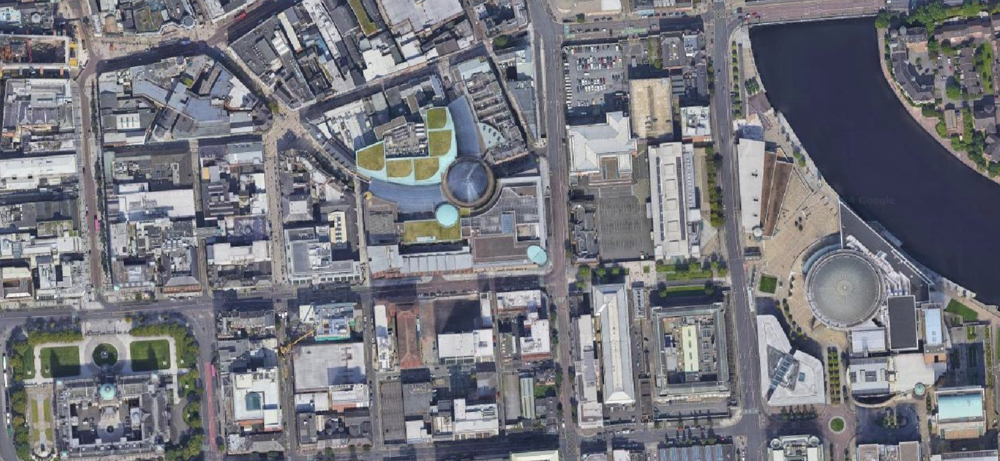
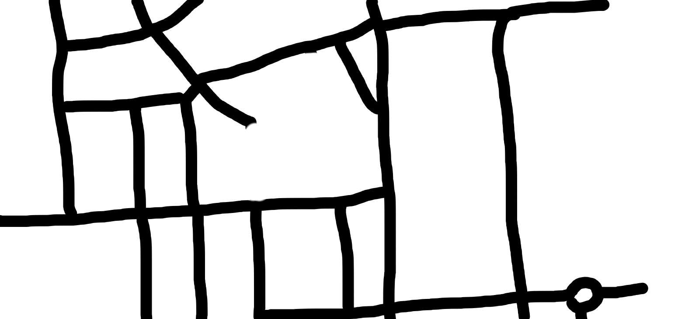

# Car Driving Simulation using DQN

This repository contains a car driving simulation using Deep Q-Networks (DQN). The simulation is built using Kivy for the graphical interface and PyTorch for the neural network implementation.

## Features

- **New Environment**: A new city map is used for training the simulation.
  
  
- **Road Mapping**: A mask is created to map the roads.
  
  
- **Random Destinations**: There are 3 destinations on the map which are randomly selected in each turn and shown with the following icon.
  

## Installation

1. Clone the repository:
    ```sh
    git clone https://github.com/Azreal18/car-game.git
    cd car-game
    ```

2. Install the required dependencies:
    ```sh
    pip install -r requirements.txt
    ```

## Usage

To run the simulation, execute the following command:
```sh
python map.py
```

## Code Structure

- [`ai.py`](./ai.py): Contains the implementation of the neural network and DQN.
- [`map.py`](./map.py): Contains the Kivy application and game logic.
- [`car.kv`](./car.kv): Kivy language file defining the UI layout.
- [`images/`](./images/): Directory containing images used in the simulation.
- [`requirements.txt`](./requirements.txt): List of dependencies required to run the project.
- [`code.md`](./code.md): Sudo code to explain whats happening


## Classes and Methods

### [`Network`](ai.py#L14)

A neural network class that defines the architecture of the DQN.

### [`ReplayMemory`](ai.py#L32)

A class to implement experience replay.

### [`Dqn`](ai.py#L49)

A class to implement the Deep Q-Learning algorithm.

### [`Car`](map.py#L69)

A class representing the car in the simulation.

### [`MyPaintWidget`](map.py#L205)

A class for handling user input and drawing on the canvas.

### [`CarApp`](map.py#L239)

The main Kivy application class.


## Sudo Code for '__init__'

This method initializes the DQN model with the given parameters.

```pseudo
class Dqn:
    method __init__(input_size, nb_action, gamma):
        set input_size
        set nb_action
        set gamma
        initialize neural network with input_size and nb_action
        initialize optimizer for the neural network
        initialize replay memory
```
